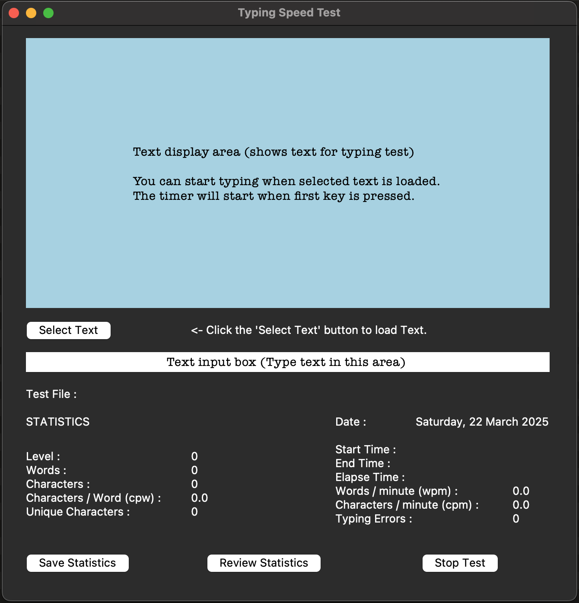

# typing-speed-test
A Python Tkinter-based typing speed test desktop application.

## Features
- Select speed typing test text files
- Analysis of typing speed and Accuracy
- Save Typing test Statistics

## Demo
Screenshot showing program in action.
Initial launch screen for the application.


Select the test text file from the assets/test_text folder. 
You can also save any test text files in the folder, for use with the app. 


Test text files should be a single paragraph and no more than around 200 words 
or 1200 characters, to ensure all text fits in the Text Display area.


Saved Typing speed test statistics window.


## Installation

### Prerequisites
* Python 3.x installed on your machine.
* (Optional) A virtual environment for isolated dependencies.

### Steps
1. Clone the repository:
```sh
git clone https://github.com/Garschke/typing-speed-test.git
cd typing-speed-test
```

2. (Optional) Create a virtual environment:
```sh
python3 -m venv .venv
source .venv/bin/activate
```
3. Install dependencies:
```sh
pip install -r requirements.txt
```

## Contributing
Feel free to fork the repo and submit pull requests!

## Fork the repository.
1. Create your feature branch: git checkout -b feature/NewFeature
2. Commit your changes: git commit -m 'Add new feature'
3. Push to the branch: git push origin feature/NewFeature
4. Open a pull request.

## Dependencies
* Python 3

## License
This project is licensed under the GPL-3.0 License - see the LICENSE file for details.
